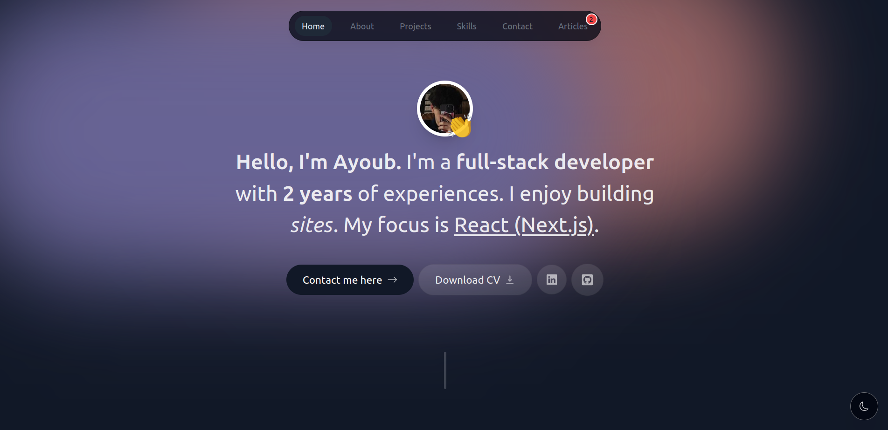
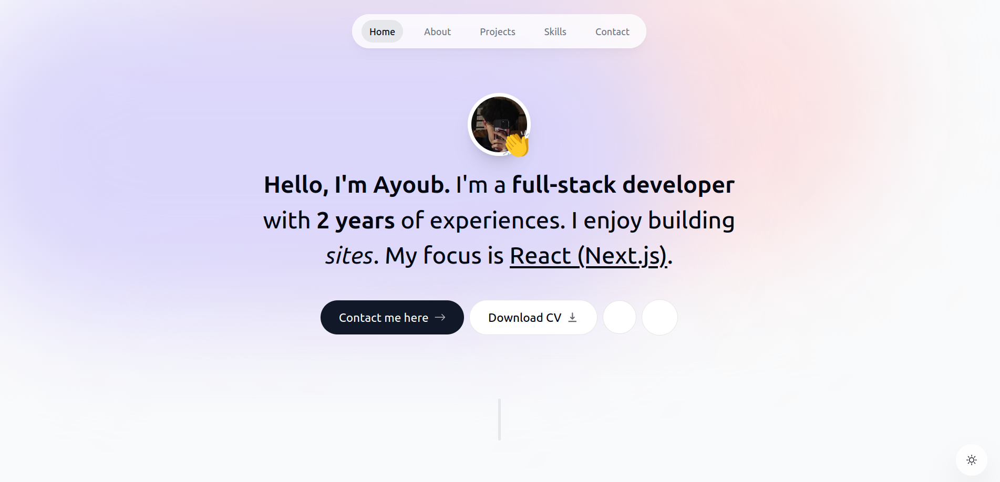
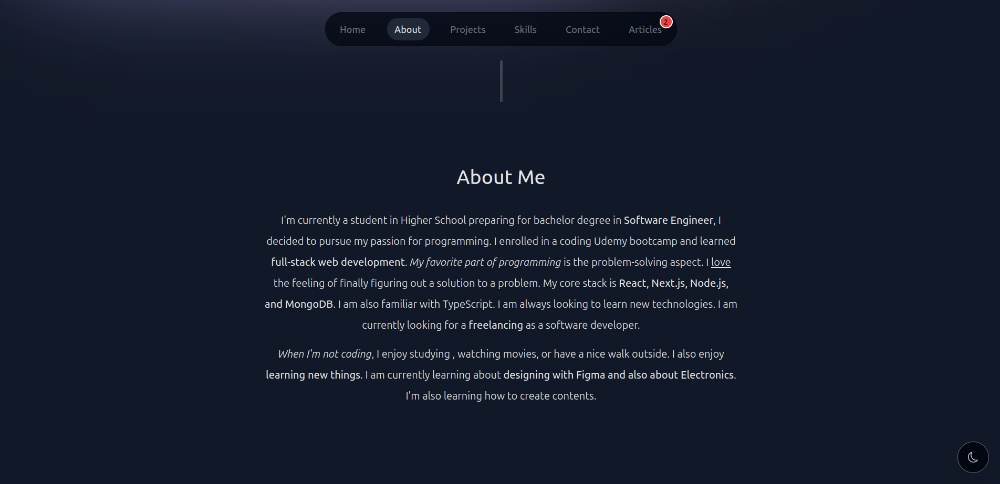
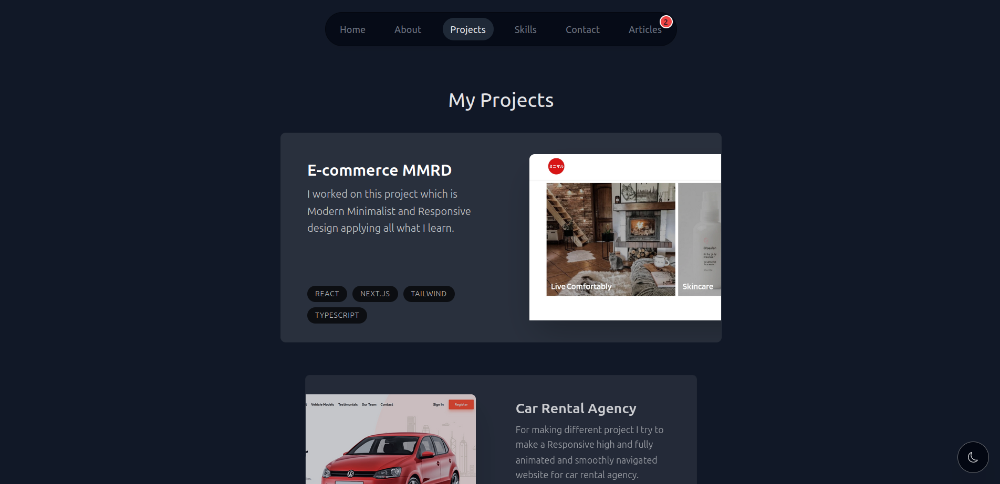
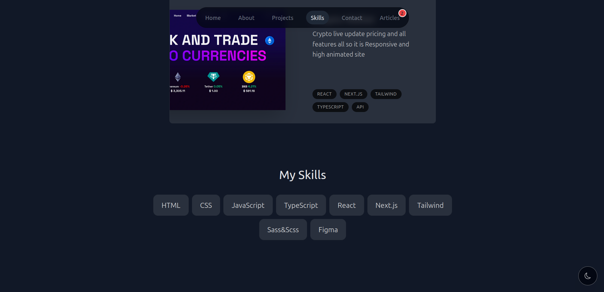
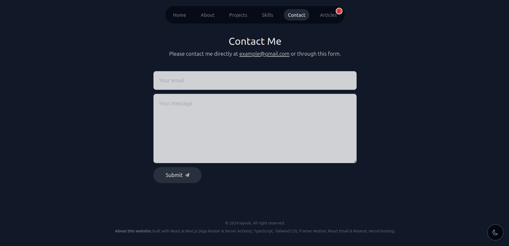

<h2>About the project</h2>

<b>Portfolio</b> High pretty sophisticated Porfolio support both light and dark mod it also high animated using Framer motion, also we work on the services from the server side to the client side and also i try to make relation between the server and the owner using Resend platform and for the styling of email i use React Email and for creation of the message and alerts i use React Toaster and now for the styling i use Clsx library for the condition styling and finally upload it to vercel.

👉 Live Demo: <a href='https://iayvob.vercel.app/'>Portfolio of me >> Demo</a>

<h3>Build with:</h3>

» Tailwind CSS  
» React JS (Next.js) » (App Router & Server Actions)  
» TypeScript  
» Framer Motion  
» React Email & Resend  
» Vercel hosting  
» React Toaster

<h2>Screenshots of the Project 📸</h2>
 
<h3 align='center'>Home Page 🏡</h3>

  
<h3 align='center'>About Page 👇</h3>

 
 
<h3 align='center'>Projects Page 👇</h3>

 
 
<h3 align='center'>Skills Page 👇</h3>

 
 
<h3 align='center'>Contact Page 👇</h3>

 
